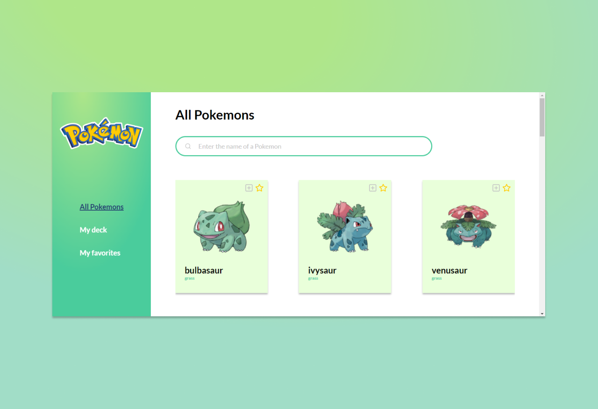
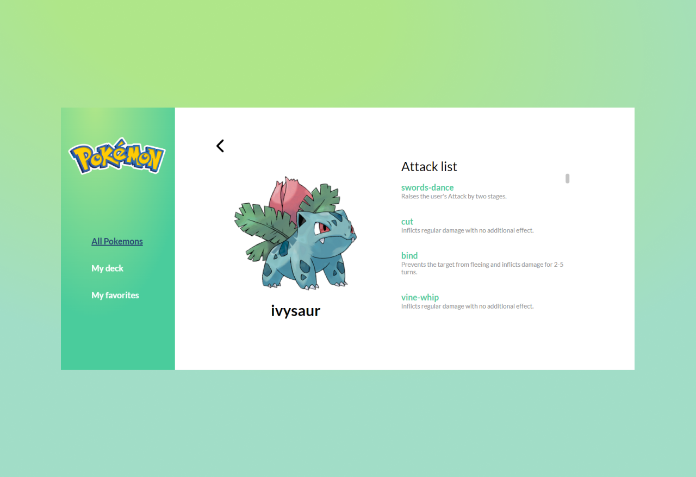
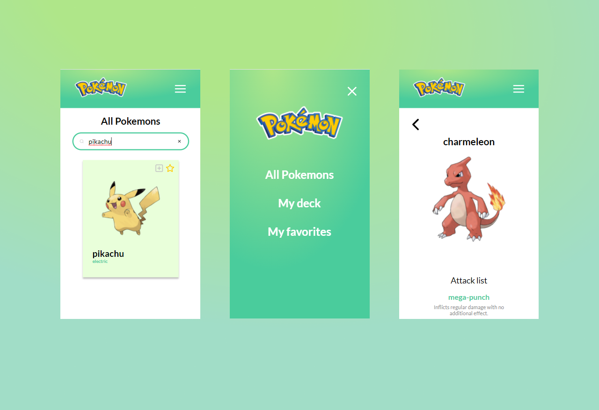

# Cards Pokémon


<p align="left">
  
</p>

<p align="left">
  
</p>

<p align="left">
  
</p>


Um app que lista cartas Pokemon. Nele é possível você visualizar, buscar, favoritar e adicionar cartas a um deck.


### Layout:

Você pode visualizar o layout do projeto através <a href="https://www.figma.com/file/UZycK1SO94Mhs3UqPjDGp5/Untitled?node-id=7%3A16">desse link</a>. É necessário ter conta no Figma para acessá-lo.


### Layout:

```sh
yarn install
```

ou

```sh
npm install
```


### Layout:

```sh
yarn start
```